# Startup-calc-system

Project for the university in the discipline 
"Startup projects and their evaluation". 
The code is written in Kotlin using Jetpack Compose & Kotlin Multiplatform, 
runs on both PC and Android. 

## Table of Contents
 - [Screenshots](#screenshots) 
 - * [1: Evaluating the effectiveness of a start-up project](#1-evaluating-the-effectiveness-of-a-start-up-project)
 - * [2: Fuzzy risk assessment of financing start-up projects](#2-fuzzy-risk-assessment-of-financing-start-up-projects)
 - * [3: Information model for assessing the rating of startup teams](#3-information-model-for-assessing-the-rating-of-startup-teams)

## Screenshots
### 1: Evaluating the effectiveness of a start-up project
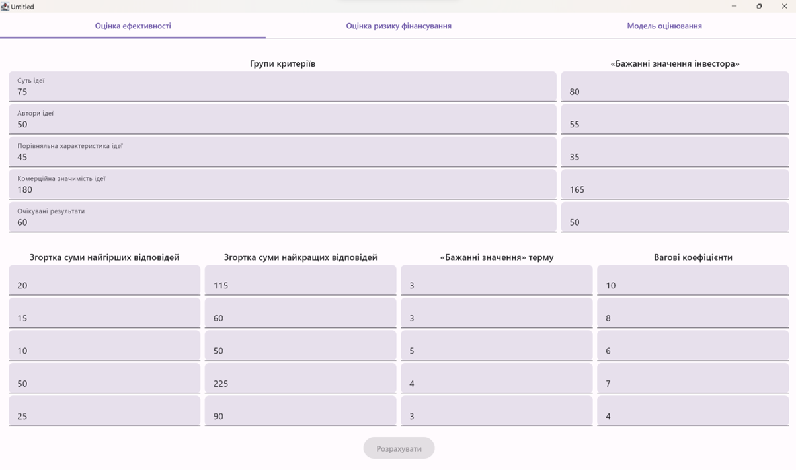
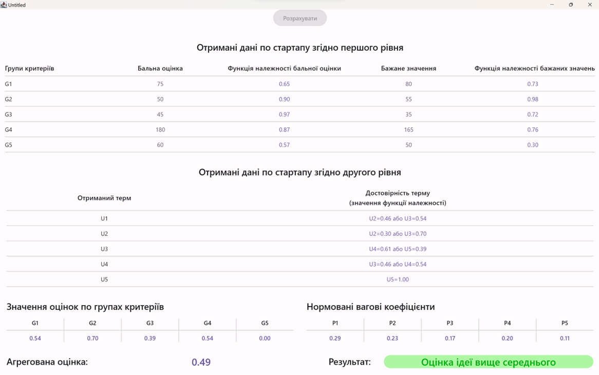
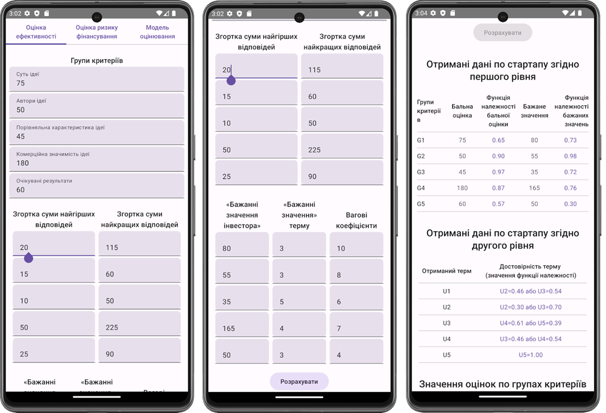
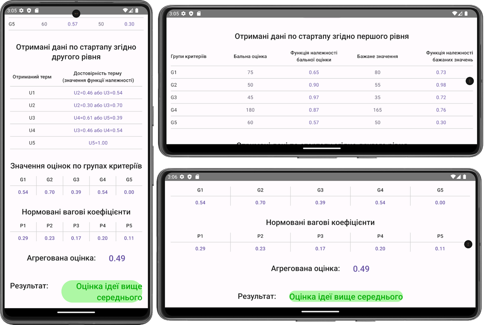

### 2: Fuzzy risk assessment of financing start-up projects
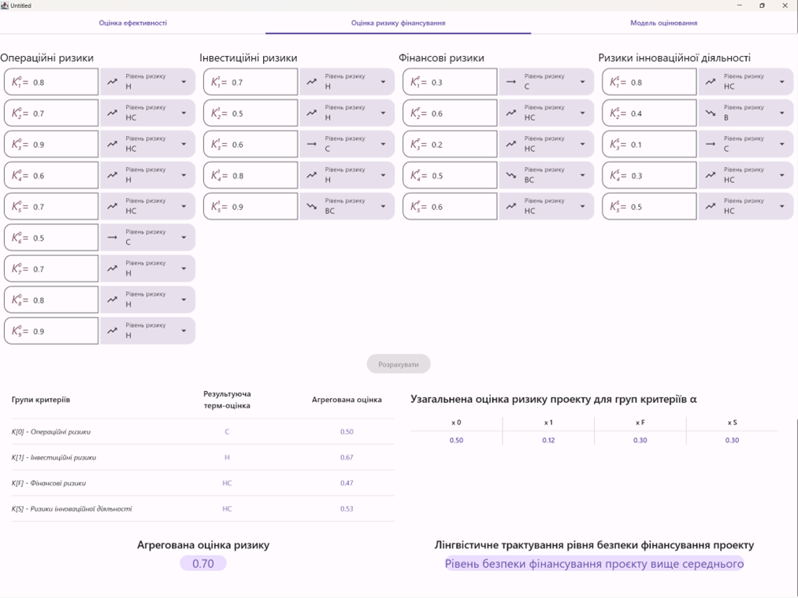
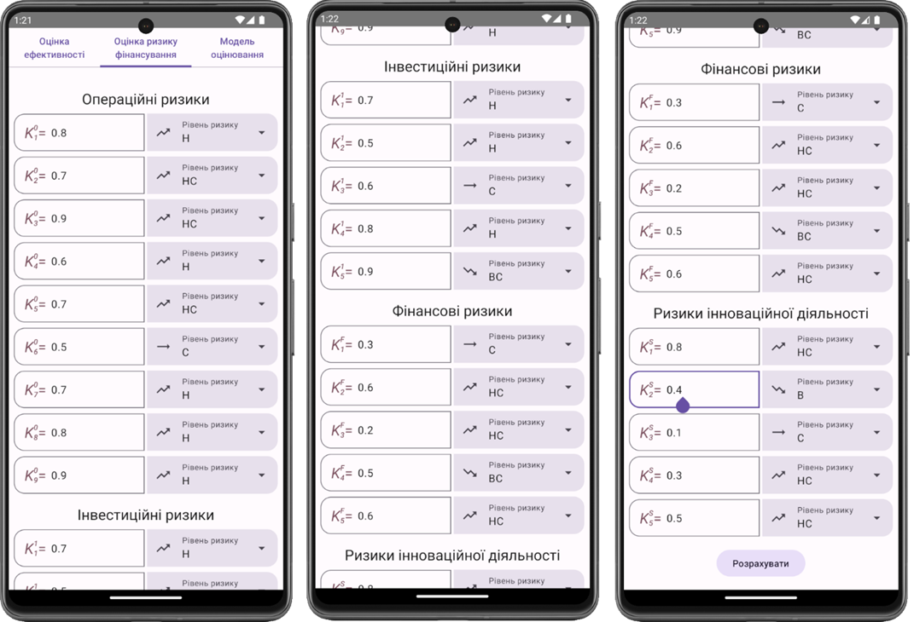
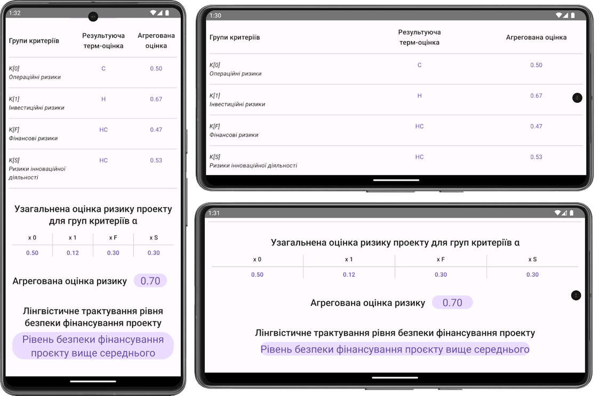

### 3: Information model for assessing the rating of startup teams
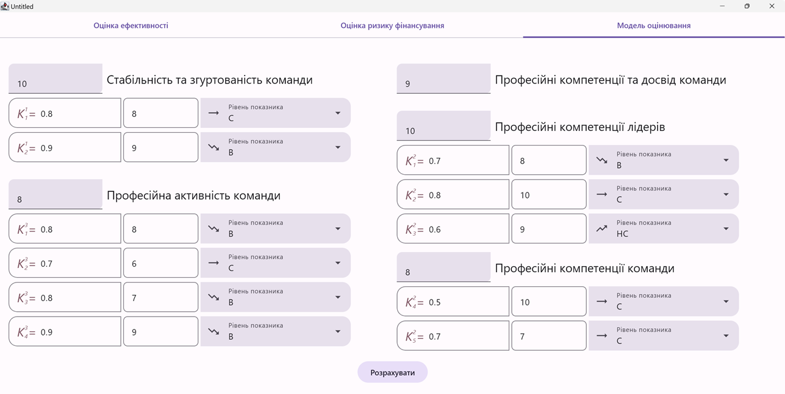
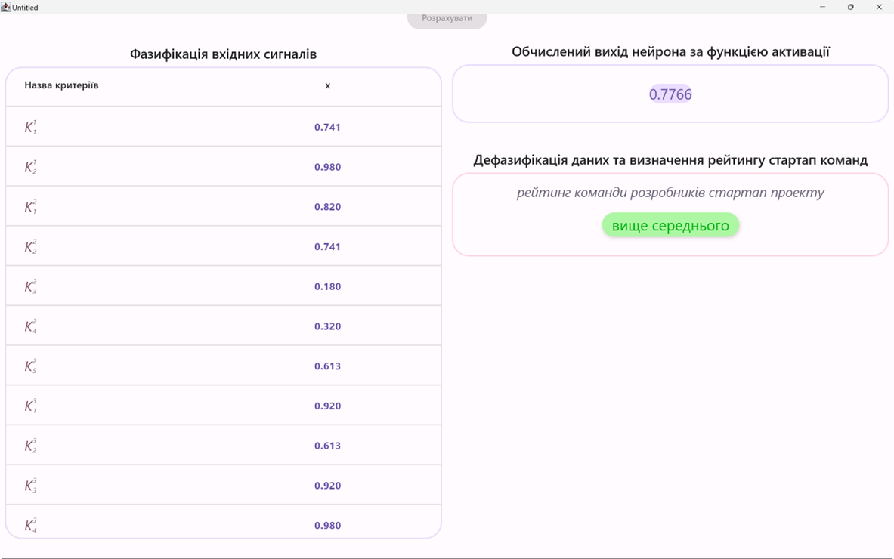
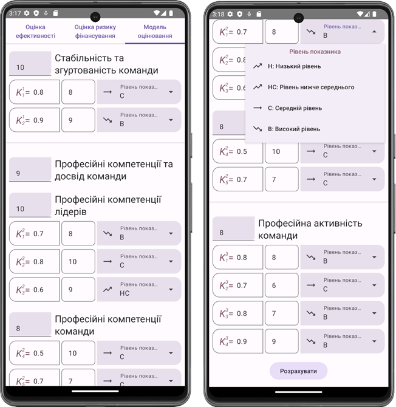
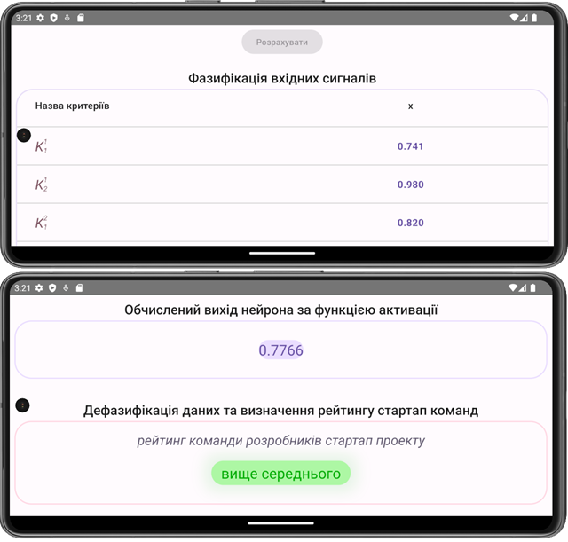
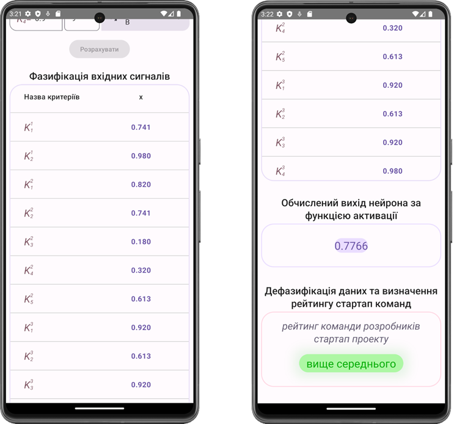

## [Back to Top](#startup-calc-system)

